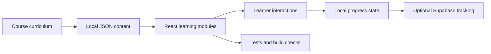

# AI Coding for Medical Education Apps

Case example: SoCal EBUS Prep

Prepared for an interventional pulmonology physician audience.

Last repo review: April 26, 2026.

## Working Title

From Course Idea to Working App: Using AI Coding Agents to Build Medical Education Software Safely

## One-Sentence Thesis

AI coding can move a physician educator from "I wish this training tool existed" to a working, tested web app, but the physician must still own the educational intent, clinical boundaries, content accuracy, privacy posture, and validation claims.

## Audience Promise

By the end, participants should be able to:

- Identify medical education app ideas that are appropriate for AI-assisted prototyping.
- Structure a project so AI coding agents produce usable, maintainable code.
- Separate curriculum content from software components.
- Explain why intended use determines whether an app remains educational/reference software or moves toward clinical decision support or medical device territory.
- Use lightweight testing and review loops to reduce the risk of silent errors.

## Recommended Webinar Flow

45 to 60 minutes:

1. Why clinicians should care about AI coding, 5 minutes.
2. Case study overview: SoCal EBUS Prep, 8 minutes.
3. How the app was structured for AI collaboration, 10 minutes.
4. Live demo: ask the AI agent to extend one small teaching feature, 12 to 15 minutes.
5. Medical app guardrails: intended use, PHI, copyrighted assets, validation claims, 10 minutes.
6. Lessons learned and reusable prompt patterns, 7 minutes.
7. Q&A, 5 to 10 minutes.

## Case Study Snapshot

SoCal EBUS Prep is a React, Vite, and TypeScript web app in `apps/web`. It is designed as an offline-first learning app for fellows preparing for an EBUS course, not as a diagnostic device.

Current repo facts from review:

- Web stack: React 19, Vite 5, TypeScript, React Router, Vitest.
- App source scale: 126 TypeScript/TSX/CSS files, about 23.6k lines.
- Curriculum content scale: 29 local JSON/Markdown files, about 18.9k lines.
- Core routes: home, pretest, lectures, knobology, stations, TNM staging, 3D anatomy case, simulator, mixed quiz, account/admin/auth.
- Tests: 19 Vitest files, 85 tests.
- Verification on April 26, 2026: `npm run typecheck`, `npm run test`, and `npm run build` all passed.
- Build note: Vite warns that the main JS chunk is large, mainly because advanced imaging and 3D viewer dependencies are bundled.

## What The App Demonstrates

### 1. The App Is A Real Learning Tool, Not A Slide Viewer

The app includes:

- A pretest gate before most modules unlock.
- A home dashboard with resume logic and progress highlights.
- A knobology module with interactive "fix the image" exercises.
- A Doppler mini-lab where learners choose safer and unsafe puncture paths in an educational approximation.
- A mediastinal station map with tap-to-learn station detail.
- Flashcards, station recognition challenges, and quiz scoring.
- A CT/bronchoscopy/EBUS station correlation model driven by structured station content.
- A 3D case viewer using CT, segmentation, markups, and patient-space coordinate logic.
- Local progress persistence, optional Supabase-backed learner tracking, and tests for important state logic.

### 2. The App Is Architected Around Content Contracts

The highest-value AI-coding decision was not a visual component. It was making the app content-driven.

Examples:

- `content/modules/knobology.json` stores knobology primer cards, control lab exercises, Doppler lab content, and quick-reference cards.
- `content/stations/core-stations.json` stores station definitions, boundaries, access notes, staging implications, and teaching cues.
- `content/stations/station-correlations.json` stores CT, bronchoscopic, and ultrasound correlate text for each station.
- `content/quizzes/*.json` stores question stems, answer choices, rationales, difficulty, and tags.
- `apps/web/src/content/types.ts` defines the TypeScript contracts that keep content and UI aligned.

This is a strong lesson for physician builders: ask AI to build durable content models before asking it to make a screen pretty.

### 3. The App Uses AI-Friendly Guardrails

The repo has a project instruction file, `AGENTS.md`, that tells the AI agent:

- Use the existing React/Vite/TypeScript app.
- Keep routing simple and explicit.
- Separate content from components.
- Keep dependencies lean.
- Preserve educational-only boundaries.
- Avoid PHI and copyrighted slide screenshots.
- Persist learner progress locally.
- Run typecheck, tests, and build checks before calling work done.

There are also module-specific agent skills for:

- Ultrasound foundations and EBUS knobology.
- Mediastinal station map.
- CT to bronchoscopic to ultrasound station explorer.

This gives the AI a reusable "course memory" so each coding session does not begin from scratch.

## Slide Outline With Speaker Notes

### Slide 1: Title

Title:
AI Coding for Medical Education Apps: Lessons from SoCal EBUS Prep

Speaker note:
"This is not a talk about replacing developers or replacing clinical judgment. It is about how a physician educator can use AI coding to create an interactive teaching tool that would otherwise stay trapped in PowerPoint, PDFs, or wishful thinking."

### Slide 2: Why This Matters In Interventional Pulmonology

Key points:

- Procedural education is visual, spatial, and repetitive.
- Many learners need pre-course preparation before hands-on simulation.
- Traditional slide decks do not preserve interactivity, learner state, or practice loops.
- EBUS anatomy is especially suited to multimodal learning: CT, bronchoscopic anatomy, ultrasound appearance, and station names.

Speaker note:
"The educational problem was not lack of information. The problem was that information was distributed across lectures, cases, mental maps, and faculty coaching. The app tries to make that structure practiceable."

### Slide 3: The Starting Product Question

Prompt to audience:
"What would I build if I could convert my teaching workflow into a small app?"

For this course, the answer was:

- Pretest.
- Lecture prep.
- Knobology practice.
- Mediastinal station map.
- CT/bronchoscopy/EBUS correlation.
- Knowledge checks.
- Progress tracking.

Speaker note:
"The physician's first job is not to tell AI what button color to use. It is to specify the educational loop: what should the learner see, do, get wrong, correct, and remember?"

### Slide 4: Case Study Product Map

Use this as a simple architecture diagram:



Speaker note:
"The most important architectural idea is that content lives outside the screen components. That means faculty can revise station descriptions or quiz explanations without rewriting the app."

### Slide 5: AI Coding Works Best With Constraints

Show a shortened version of the project rules:

- Use the existing app stack.
- Keep content local and structured.
- No PHI.
- No copyrighted slide screenshots.
- Educational product, not diagnostic software.
- Simulated visuals are not clinically validated.
- Run checks before done.

Speaker note:
"The AI is much more useful when the project has a constitution. Without written constraints, it will happily build something impressive and inappropriate."

### Slide 6: Demo Moment 1 - Knobology As A Micro-Simulator

Show:

- The knobology route.
- A bad image state.
- Depth/gain/contrast controls.
- Immediate feedback.
- Doppler path challenge.

Teaching message:
"We did not need a physically accurate ultrasound simulator to teach beginner knobology. We needed a constrained interaction that makes the learner practice the sequence: frame, brighten, separate edges, check Doppler, freeze, measure, save."

Speaker note:
"This is a good AI-assisted feature because the domain expert can define the learning states and the AI can implement the interaction logic and UI."

### Slide 7: Demo Moment 2 - Station Map And Structured Anatomy

Show:

- Station map.
- Tap station.
- Station detail.
- Boundary notes.
- Memory cues.
- Bookmarks.
- Recognition quiz.

Teaching message:
"The map is not just a graphic. It is backed by structured station data. That structure is what lets the same station appear in a map, a detail sheet, a quiz, a flashcard, and a tri-view explorer."

### Slide 8: Demo Moment 3 - CT/Bronchoscopy/EBUS Correlation

Show:

- Station selector.
- CT correlate.
- Bronchoscopic correlate.
- EBUS/ultrasound correlate.
- Landmark checklist.

Teaching message:
"This is where AI coding becomes educationally interesting. The app can repeatedly show the same concept through different modalities, while keeping the learner anchored to the same station ID and same content contract."

### Slide 9: Demo Moment 4 - The Harder Edge: 3D Anatomy

Show:

- Case 001 viewer if stable in the live environment.
- Crosshair/planes/segmentation overlays.
- A note that this is more complex and needs stricter validation.

Speaker note:
"The 3D case viewer is the boundary where a teaching app starts to look like clinical imaging software. That does not automatically make it a device, but it raises the burden for clarity: de-identification, geometry correctness, performance, and claims."

### Slide 10: What AI Actually Helped With

Useful work for AI coding agents:

- Convert product intent into route structure.
- Scaffold reusable React components.
- Create TypeScript content contracts.
- Generate initial JSON content structure.
- Implement local storage state and normalization.
- Add quiz scoring logic and tests.
- Refactor repeated patterns into feature folders.
- Build interactive controls and feedback states.
- Run and interpret typecheck/test/build loops.

Things the physician must still own:

- Curriculum truth.
- Intended use.
- Safety language.
- Educational progression.
- What counts as correct feedback.
- Whether assets are permitted.
- Whether a claim is clinically supported.

### Slide 11: The Medical App Boundary

Use three questions:

1. Is the app teaching general concepts, or helping assess a specific patient?
2. Does the app merely display/reference information, or does it analyze/interpret patient data?
3. Does the app make recommendations that could affect diagnosis, treatment, or procedural decisions?

Case study answer:

SoCal EBUS Prep is framed as an educational app. It uses local content, simulated teaching visuals, de-identified or app-owned assets, and does not make patient-specific diagnostic recommendations.

Important nuance:

The same codebase could move into higher-risk territory if it started accepting patient CTs, recommending sampling order for a real patient, interpreting ultrasound images, or claiming clinically validated performance.

### Slide 12: Privacy And Asset Rules

The app's practical rules:

- Do not paste PHI into prompts.
- Do not upload identifiable images to external AI tools without explicit institutional approval and a compliant workflow.
- Use app-owned diagrams or fully approved, de-identified teaching assets.
- Do not ship copyrighted slide screenshots as production UI.
- Keep simulated visuals labeled as educational approximations.

Speaker note:
"AI coding makes it easy to move fast enough to violate privacy or copyright by accident. The workflow has to make the safe path the default path."

### Slide 13: Testing Is A Clinical Culture Skill

Repo verification:

- `npm run typecheck`: passed.
- `npm run test`: 85 tests passed.
- `npm run build`: passed.
- No lint script is currently configured.
- Build warning: main chunk is large due to heavy imaging/3D dependencies.

Speaker note:
"A passing test suite does not validate medical content, but it does catch a different class of errors: score calculations, state persistence, access gating, asset mapping, and reducer behavior."

### Slide 14: Lessons Learned

1. Start with a narrow educational loop, not a full platform.
2. Write the project rules before asking for code.
3. Make content structured and local.
4. Keep simulations humble and clearly labeled.
5. Add tests around state, scoring, and access logic.
6. Let the app grow module by module.
7. Be cautious when moving from education into patient-specific data or clinical recommendations.

### Slide 15: Reusable Playbook

For a physician building a medical education app:

1. Define the learner, setting, and one behavior you want to change.
2. Write a one-page product spec.
3. Write an `AGENTS.md` or equivalent AI instruction file.
4. Create content schemas before UI polish.
5. Build one interactive module end to end.
6. Add tests for the logic you cannot afford to silently break.
7. Review every medical statement as faculty, not as a coder.
8. Ship internally, gather feedback, then iterate.

## Live Coding Demo Options

### Demo Option A: Low Risk, High Value

Add a "review missed stations" panel after the station quiz.

Why it works:

- Uses existing station recognition stats.
- Reinforces retrieval practice.
- Does not require new medical claims.
- Can be implemented and tested quickly.

Example prompt:

```text
Read AGENTS.md and the existing stations route code. Add a small review panel to the station quiz page that lists stations with missed recognition attempts, shows correct/attempt counts, and links back to the explore tab for each station. Keep the data derived from existing learner progress state. Do not add dependencies. Add or update tests if logic is extracted. Run typecheck and tests.
```

### Demo Option B: Content-First

Add a new station teaching pearl to the structured station content.

Why it works:

- Demonstrates content separation.
- Lets faculty edit the educational source of truth.
- Avoids changing complex UI.

Example prompt:

```text
Read the station content schema and authoring guide. Add a concise teaching pearl field to core station content and render it in the station detail panel only when present. Keep existing station fields backward compatible. Add a small type-safe implementation and run typecheck.
```

### Demo Option C: Safety-Language Pass

Add consistent educational-only disclaimers to simulation-heavy modules.

Why it works:

- Shows medical governance as part of coding.
- Reinforces intended use.
- Makes the app safer without adding complexity.

Example prompt:

```text
Review the simulation-heavy routes for educational-only language. Add concise, non-alarming language where needed so users understand that simulated visuals are for orientation training and are not clinically validated diagnostic images. Keep text in local content files when possible. Run typecheck.
```

## Prompt Patterns For Physician Builders

### The Project Setup Prompt

```text
You are helping build a medical education app, not a diagnostic device. Read the product spec and AGENTS.md first. Use the existing stack. Keep curriculum text in local JSON or Markdown. Do not use PHI. Do not add large dependencies without asking. Make the smallest clean change, then run typecheck, tests, and build.
```

### The Feature Prompt

```text
Build one complete learning interaction for [specific learner task]. The learner should [see/do/answer], receive immediate feedback, and have progress saved locally. Keep content separate from UI components. Add tests for scoring, state transitions, or data normalization.
```

### The Review Prompt

```text
Review this change as a medical education software reviewer. Look for broken learner flows, incorrect state persistence, hidden medical-device claims, PHI/copyright risk, inaccessible controls, missing tests, and places where simulated visuals could be mistaken for validated clinical output.
```

### The Content Prompt

```text
Convert this faculty teaching outline into structured JSON that matches the existing schema. Preserve medical nuance. Avoid patient-specific recommendations. Mark any uncertain claims as needing faculty review instead of inventing citations.
```

### The Test Prompt

```text
Before changing UI, identify the logic that should be tested. Add focused tests for scoring, progress persistence, quiz correctness, route gating, and malformed stored state. Then run the existing test suite.
```

## Medical-App Guardrails To Discuss

### 1. Intended Use Is The Center

FDA materials distinguish educational/reference functions from software functions used for diagnosis, treatment, mitigation, prevention, or clinical assessment. FDA examples of non-device functions include tools for health care professional education such as medical flashcards, quiz apps, interactive anatomy diagrams/videos, surgical training videos, and board preparation apps, when they are intended generally for education and not for assessing a specific patient.

How this applies here:

- Good: "This module teaches how EBUS controls affect image readability."
- Good: "This station map helps learners practice IASLC station recognition."
- Riskier: "Upload a patient CT and the app recommends which nodes to biopsy."
- Riskier: "The app analyzes ultrasound video and identifies malignant nodes."

### 2. Educational Simulation Is Not Clinical Validation

SoCal EBUS Prep uses simulated or app-owned visuals for training. This supports learning, but the app should avoid claims such as:

- "Clinically validated."
- "Accurately simulates ultrasound physics."
- "Determines safe needle paths."
- "Predicts malignancy."

Safer language:

- "Educational approximation."
- "Orientation training only."
- "Not for diagnosis or patient-specific procedural planning."
- "Faculty review required for clinical application."

### 3. PHI Must Stay Out Of Prompts And Assets

HHS de-identification guidance emphasizes that identifiers can exist in structured fields and free text. For AI coding workflows, this means:

- Do not paste identifiable clinical narratives into prompts.
- Do not assume screenshots are safe just because names are cropped.
- Do not upload DICOMs or bronchoscopy images without an approved de-identification and governance workflow.
- Remember that rare clinical stories can remain identifiable even after obvious identifiers are removed.

### 4. AI Risk Management Is A Workflow, Not A Disclaimer

NIST's AI Risk Management Framework describes AI risk management across design, development, use, and evaluation. For a small medical education app, translate that into lightweight habits:

- Map the intended users and misuse cases.
- Measure whether the app behaves as expected.
- Manage changes through tests and review.
- Govern content updates with faculty ownership.

## Suggested Screenshots Or Live Screens

Capture these for slides:

- Home page showing course flow and module cards.
- Pretest gate message.
- Knobology fix-the-image lab.
- Doppler mini-lab path selection.
- Station map with a selected station.
- Station detail panel with boundaries and staging implications.
- Station recognition challenge feedback.
- Content JSON side-by-side with rendered UI.
- Terminal showing passing tests.
- Optional: 3D case viewer to discuss complexity and validation boundaries.

## Audience Q&A Prep

Question:
"Can I build this without knowing how to code?"

Answer:
"You can get surprisingly far if you can describe the product clearly, review outputs critically, and run checks. But you still need a disciplined workflow: version control, tests, content review, and a willingness to inspect what the AI changed."

Question:
"Can I upload clinical images and have AI build around them?"

Answer:
"Only inside an approved institutional workflow. For routine AI coding, assume no PHI and no identifiable clinical images. Use de-identified, approved, app-owned, or synthetic teaching assets."

Question:
"When does an education app become a medical device?"

Answer:
"The line depends on intended use and function. General medical education, flashcards, quizzes, and interactive anatomy teaching can be outside device scope when they are not used for diagnosis or clinical assessment. Patient-specific analysis, recommendations, or device-like functions can change the regulatory picture."

Question:
"How do I prevent the AI from making up medical content?"

Answer:
"Do not ask the AI to be the source of truth. Give it faculty-authored content, require uncertain claims to be marked for review, keep text in content files, and make faculty review part of the merge process."

Question:
"What is the highest-yield first app to build?"

Answer:
"A narrow training loop: one learner, one repeated task, one measurable interaction. For example, station recognition, image optimization sequence, complication checklist rehearsal, or post-lecture retrieval practice."

## Three Take-Home Messages

1. AI coding is most powerful when the physician supplies the educational structure.
2. Medical app safety starts with intended use, data boundaries, and claim discipline.
3. The best first product is not a huge platform. It is a small interactive learning loop that can be reviewed, tested, and improved.

## References For Guardrail Slides

- FDA, "Examples of Software Functions That Are NOT Medical Devices": https://www.fda.gov/medical-devices/device-software-functions-including-mobile-medical-applications/examples-software-functions-are-not-medical-devices
- FDA, "Device Software Functions Including Mobile Medical Applications": https://www.fda.gov/medical-devices/digital-health-center-excellence/device-software-functions-including-mobile-medical-applications
- FDA, "Artificial Intelligence in Software as a Medical Device": https://www.fda.gov/medical-devices/software-medical-device-samd/artificial-intelligence-software-medical-device
- HHS, "Guidance Regarding Methods for De-identification of Protected Health Information": https://www.hhs.gov/hipaa/for-professionals/special-topics/de-identification/index.html
- NIST, "AI Risk Management Framework": https://www.nist.gov/itl/ai-risk-management-framework

